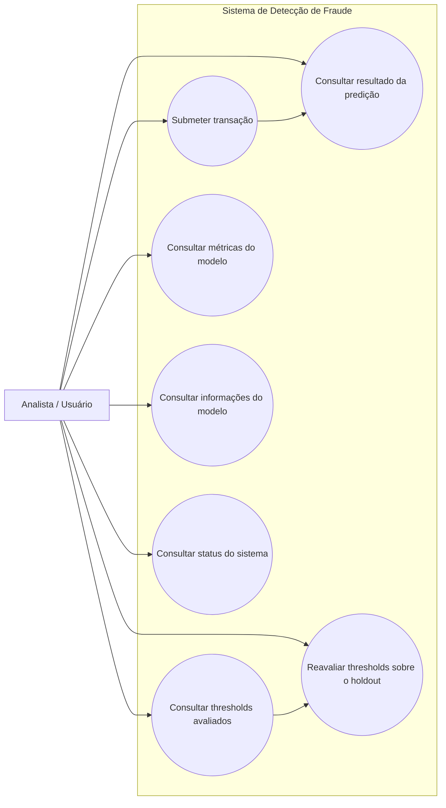

# Diagrama de Caso de Uso

> O MVP não implementa edição persistente do threshold operacional em tempo real. A funcionalidade disponível é a consulta e a reavaliação de thresholds com base no artefato serializado.
