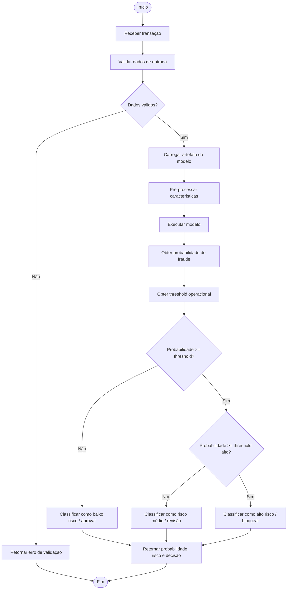

# Diagrama de Atividade — Predição de Fraude

```mermaid
flowchart TD
    S([Início]) --> A[Receber transação]
    A --> B[Validar dados de entrada]
    B --> C{Dados válidos?}
    C -- Não --> E[Retornar erro de validação]
    E --> F([Fim])
    C -- Sim --> D[Carregar artefato do modelo]
    D --> G[Pré-processar características]
    G --> H[Executar modelo]
    H --> I[Obter probabilidade de fraude]
    I --> J[Obter threshold operacional]
    J --> K{Probabilidade >= threshold?}
    K -- Não --> L[Classificar como baixo risco / aprovar]
    K -- Sim --> M{Probabilidade >= threshold alto?}
    M -- Não --> N[Classificar como risco médio / revisão]
    M -- Sim --> O[Classificar como alto risco / bloquear]
    L --> P[Retornar probabilidade, risco e decisão]
    N --> P
    O --> P
    P --> F
```
