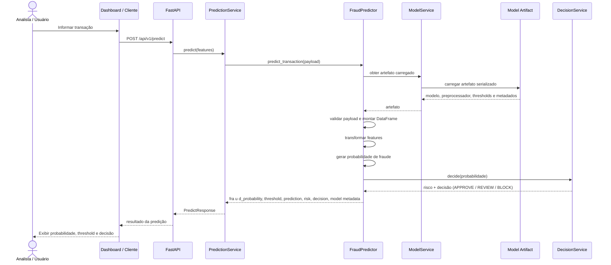

# Diagrama de Sequência — Predição

```mermaid
sequenceDiagram
    actor Usuario as Analista / Usuário
    participant Cliente as Dashboard / Cliente
    participant API as FastAPI
    participant PS as PredictionService
    participant FP as FraudPredictor
    participant MS as ModelService
    participant MA as Model Artifact
    participant DS as DecisionService

    Usuario->>Cliente: Informar transação
    Cliente->>API: POST /api/v1/predict
    API->>PS: predict(features)
    PS->>FP: predict_transaction(payload)
    FP->>MS: obter artefato carregado
    MS->>MA: carregar artefato serializado
    MA-->>MS: modelo, preprocessador, thresholds e metadados
    MS-->>FP: artefato
    FP->>FP: validar payload e montar DataFrame
    FP->>FP: transformar features
    FP->>FP: gerar probabilidade de fraude
    FP->>DS: decide(probabilidade)
    DS-->>FP: risco + decisão (APPROVE / REVIEW / BLOCK)
    FP-->>PS: fra u d_probability, threshold, prediction, risk, decision, model metadata
    PS-->>API: PredictResponse
    API-->>Cliente: resultado da predição
    Cliente-->>Usuario: Exibir probabilidade, threshold e decisão
```
