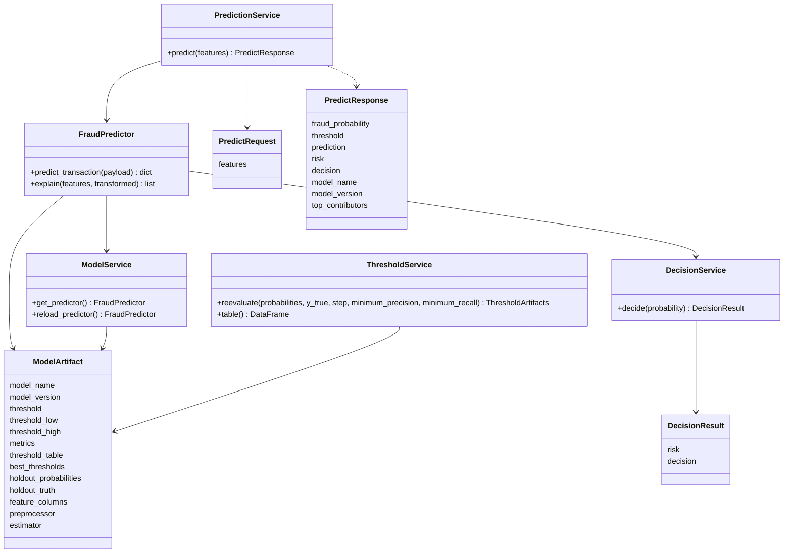

# Diagrama de Classes

```mermaid
classDiagram
    class PredictionService {
      +predict(features) PredictResponse
    }
    class ModelService {
      +get_predictor() FraudPredictor
      +reload_predictor() FraudPredictor
    }
    class DecisionService {
      +decide(probability) DecisionResult
    }
    class ThresholdService {
      +reevaluate(probabilities, y_true, step, minimum_precision, minimum_recall) ThresholdArtifacts
      +table() DataFrame
    }
    class FraudPredictor {
      +predict_transaction(payload) dict
      +explain(features, transformed) list
    }
    class ModelArtifact {
      model_name
      model_version
      threshold
      threshold_low
      threshold_high
      metrics
      threshold_table
      best_thresholds
      holdout_probabilities
      holdout_truth
      feature_columns
      preprocessor
      estimator
    }
    class PredictRequest {
      features
    }
    class PredictResponse {
      fraud_probability
      threshold
      prediction
      risk
      decision
      model_name
      model_version
      top_contributors
    }
    class DecisionResult {
      risk
      decision
    }

    PredictionService --> FraudPredictor
    PredictionService ..> PredictRequest
    PredictionService ..> PredictResponse
    FraudPredictor --> ModelService
    FraudPredictor --> DecisionService
    FraudPredictor --> ModelArtifact
    DecisionService --> DecisionResult
    ModelService --> ModelArtifact
    ThresholdService --> ModelArtifact
```
