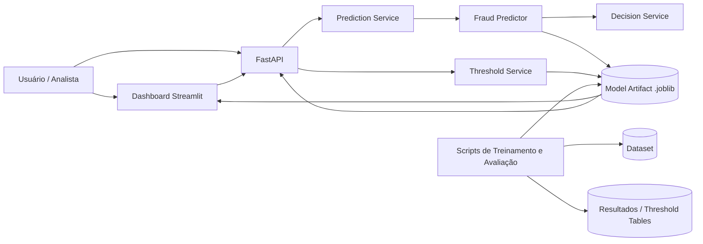

# Diagrama de Componentes

```mermaid
flowchart LR
    U[Usuário / Analista]
    FE[Dashboard Streamlit]
    API[FastAPI]
    P[Prediction Service]
    FP[Fraud Predictor]
    D[Decision Service]
    T[Threshold Service]
    E[Scripts de Treinamento e Avaliação]
    ART[(Model Artifact .joblib)]
    DATA[(Dataset)]
    RES[(Resultados / Threshold Tables)]

    U --> FE
    U --> API
    FE --> API
    API --> P
    P --> FP
    FP --> D
    FP --> ART
    API --> T
    T --> ART
    E --> DATA
    E --> ART
    E --> RES
    ART --> FE
    ART --> API
```
