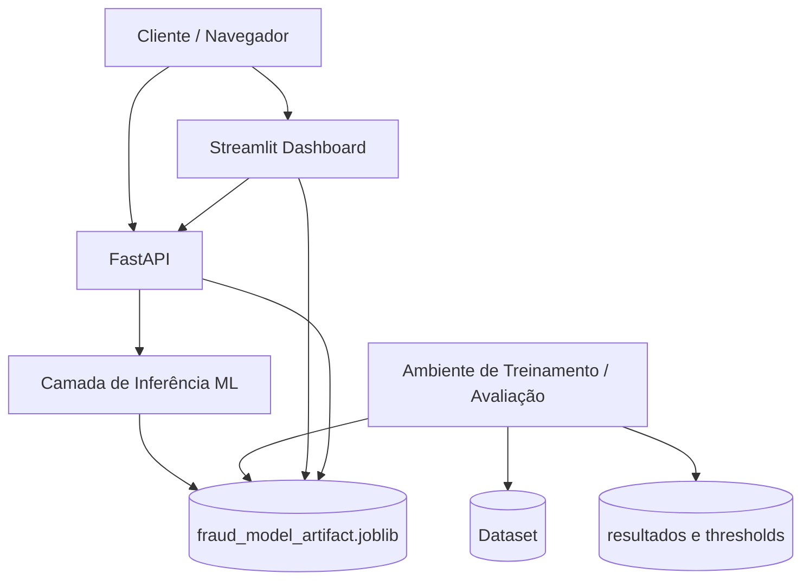

# Diagrama de Implantação

A implantação segue a estratégia do projeto: frontend Streamlit e API FastAPI consumindo um artefato serializado previamente treinado. A etapa de treinamento e reavaliação de thresholds acontece em ambiente separado e gera o artefato e os resultados experimentais, sem alterar o comportamento da inferência em tempo real.
