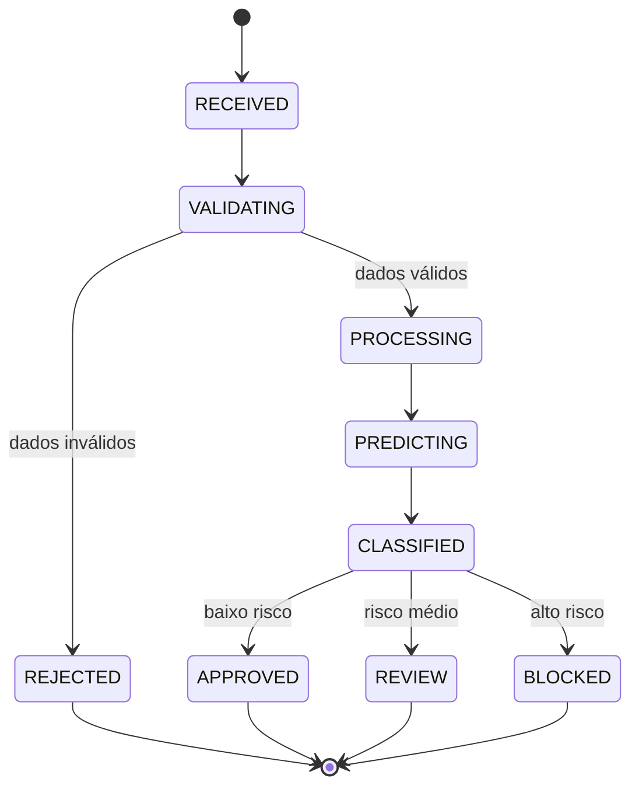

# Diagrama de Estados — Predição

```mermaid
stateDiagram-v2
    [*] --> RECEIVED
    RECEIVED --> VALIDATING
    VALIDATING --> REJECTED : dados inválidos
    VALIDATING --> PROCESSING : dados válidos
    PROCESSING --> PREDICTING
    PREDICTING --> CLASSIFIED
    CLASSIFIED --> APPROVED : baixo risco
    CLASSIFIED --> REVIEW : risco médio
    CLASSIFIED --> BLOCKED : alto risco
    REJECTED --> [*]
    APPROVED --> [*]
    REVIEW --> [*]
    BLOCKED --> [*]
```
