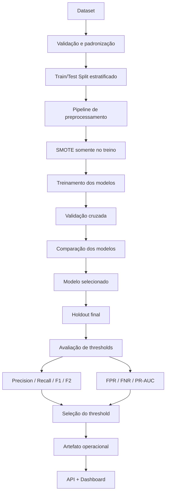

# Diagrama do Experimento Científico

```mermaid
flowchart TD
    A[Dataset] --> B[Validação e padronização]
    B --> C[Train/Test Split estratificado]
    C --> D[Pipeline de preprocessamento]
    D --> E[SMOTE somente no treino]
    E --> F[Treinamento dos modelos]
    F --> G[Validação cruzada]
    G --> H[Comparação dos modelos]
    H --> I[Modelo selecionado]
    I --> J[Holdout final]
    J --> K[Avaliação de thresholds]
    K --> L[Precision / Recall / F1 / F2]
    K --> M[FPR / FNR / PR-AUC]
    L --> N[Seleção do threshold]
    M --> N
    N --> O[Artefato operacional]
    O --> P[API + Dashboard]
```
